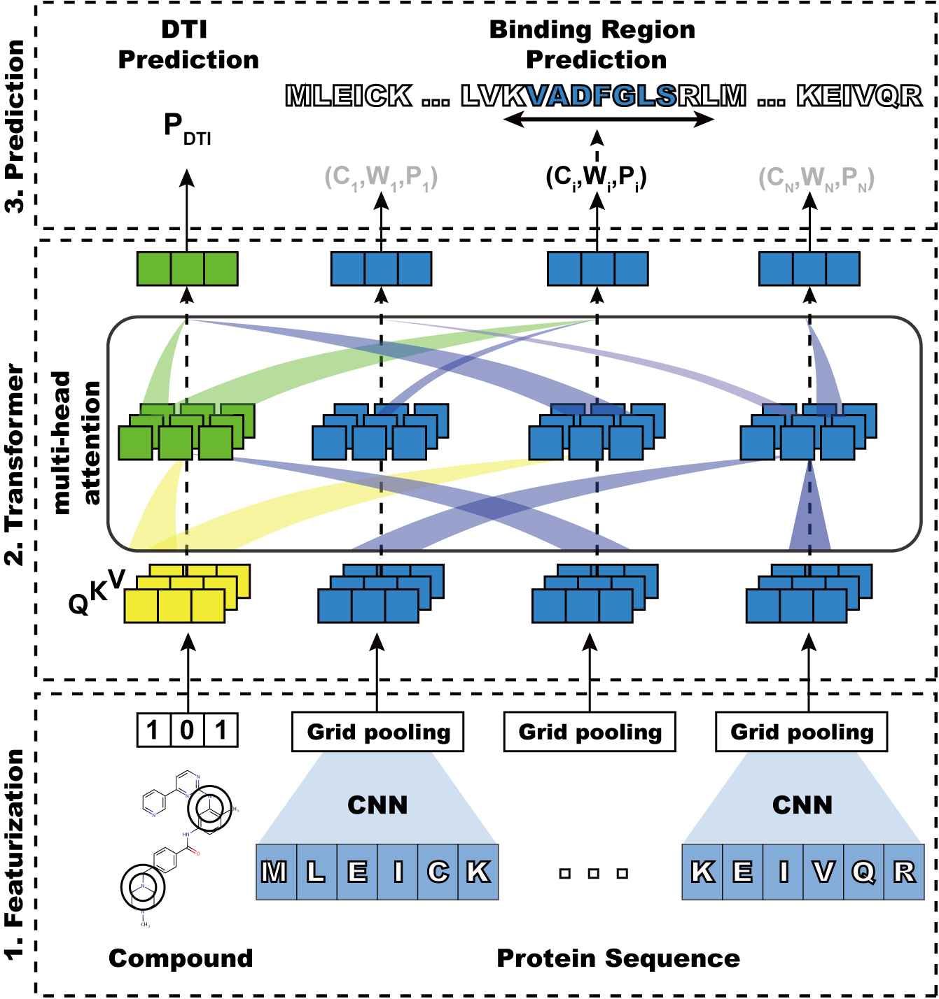

# HoTS: Sequence-based prediction of binding regions and drug-target interactions

## Introduction

Lee, I., Nam, H. [Sequence-based prediction of protein binding regions and drug–target interactions](https://jcheminf.biomedcentral.com/articles/10.1186/s13321-022-00584-w). J Cheminform 14, 5 (2022). https://doi.org/10.1186/s13321-022-00584-w

Recently, many feature-based drug-target interaction (DTI) prediction models have been developed.
Especially for protein features, many models take a raw amino acid sequence as the input, building an end-to-end model.

This model gives some advantages for prediction, such as

  * Model catches local patterns whose information is lost in global features. 
  * Model becomes more informative and interpretable than the model using global feature

DeepConv-DTI and DeepAffinity show that a deep learning model with protein sequence capture local residue pattern participating in the interaction with ligands.
Therefore, we can hypothesize that increasing ability to capture important interacting motifs will also increase performances of DTI prediction.
However, how can the ability to capture important local motifs for the drug-target prediction model?

In DeepConv-DTI, the variety size of convolutional neural networks (CNN) captures local residue patterns.
Then, we can explicitly train CNN and further layers to concentrate on binding information.

So, we built a model on protein sequence to predict ``binding region (BR)``, called **Highlights on Protein Sequence (HoTS)**.
We predict BRs of protein in the way of object detection in the image processing field.

We refer **BR** as a consecutive subsequence including ``binding pockets/sites (binding information, BI)`` interacting with ligand in the protein-ligand complex.

By predicting BR, the performances of DTI prediction increase from previous model [DeepConv-DTI](https://journals.plos.org/ploscompbiol/article?id=10.1371/journal.pcbi.1007129).

Moreover, as pointed out in [studies](https://www.researchgate.net/publication/335085389_Improved_fragment_sampling_for_ab_initio_protein_structure_prediction_using_deep_neural_networks), inter-dependency between protein motifs must be considered for better representation

Our model utilized [Transformers](https://arxiv.org/abs/1706.03762) to model interdependency between sequential grids.
Moreover, we added a compound token before protein grids as ``<CLS>`` token is added to predict sentence class. The transformer also will model the interaction between protein and compound.

Our model is depicted as [overview figure](Figures/Fig_1.jpg)

## License


HoTS follows [GPL 3.0v license](LICENSE). Therefore, HoTS is open source and free to use for everyone.

However, compounds which are found by using HoTS follows [CC-BY-NC-4.0](CC-BY-NC-SA-4.0). Thus, those compounds are freely available for academic purposes or individual research but restricted for commercial use.

## Contact

hjnam@gist.ac.kr

dlsrnsladlek@gist.ac.kr


## Overview Figure



## Environment set-up

conda environment file [environment.yml](environment.yml) is provided

``` 
conda env create --name envname --file=environments.yml
```

## Usage

```
    This Python script is used to train, and validate sequence-based deep learning model for prediction of drug-target interaction (DTI) and binding region (BR)
    Keras will build deep learning model with tensorflow.
    You can set almost hyper-parameters as you want; see below parameter description.
    DTI, drug, and protein data must be written in a csv file format. And feature should be in tab-delimited format for the script to parse data.
    And for BR, Protein Sequence, binding region, and SMILES are needed in tsv. You can check the format in sample data. 

    Requirement
    ============================ 
    tensorflow == 1.12.0 
    keras == 2.2.4 
    numpy 
    pandas 
    scikit-learn 
    tqdm
    rdkit
    biopython
    ============================

    contact : dlsrnsladlek@gist.ac.kr
              hjnam@gist.ac.kr
```

## Input config specification

The input config file should be `json` format, and each value should be specified as follows:

### Input file paramters
```
    "dti_dir"                   : Training DTI file path
    "drug_dir"                  : Training Compound file path
    "protein_dir"               : Training Protein file path
    "hots_dir"                  : Training BR file path
    "validation_dti_dir"        : Validation file path
    "validation_drug_dir"       : Validaton file path
    "validation_protein_dir"    : Validation file path
    "validation_hots_dir"       : Validation BR file path
```
### Compound feature paramters
```    
    "drug_len"                  : the number of bits for Morgan fingerprint
    "radius"                    : the size of radius for Morgan fingerprint
```
### Model shape parameters
```
    "window_sizes"              : Protein convolution window sizes (should be list of integers)
    "n_filters"                 : Convolution filter size
    "drug_layers"               : Dense layers on compound fingerprint (should be list of integers)
    "hots_dimension"            : Size of dimension for Transformer
    "n_heads"                   : the number of heads in Transformer
    "n_transformers_hots"       : the number of Transformer blocks for BR prediction
    "n_transformers_dti"        : the number of Transformer blocks for DTI prediction
    "hots_fc_layers"            : Dense layers for BR prediction (should be list of integers)
    "dti_fc_layers"             : Dense layers for DTI prediction (should be list of integers)
    "anchors"                   : Predifined widths (anchor without coord offset, should be list of integers)
    "grid_size"                 : Protein grid size
```
### Training parameters
```
    "learning_rate"             : Learning rate
    "n_pretrain"                : the number of BR pre-training epochs
    "n_epochs"                  : the number of DTI training epochs
    "hots_ratio"                : the number of BR training epochs per one DTI training
    "activation"                : activation function of model
    "dropout"                   : Dropout rate
    "batch_size"                : Training mini-batch size
    "decay"                     : Learning rate decay
```
### Loss parameters
```
    "retina_loss"               : Retina loss weight
    "confidence_loss"           : Confidence loss weight for BR prediction
    "regression_loss"           : Regression loss weight for BR prediction
    "negative_loss"             : Negative loss eight for BR prediction
``` 
### Output paramters
```
    "output"                    : Output file path, this script will result in 
               {output}.config.json     : Model hyperparameter file
               {output}.HoTS.h5         : BR prediction model weight file
               {output}.DTI.h5          : DTI prediction model weight file
```

## Example command and use of model

defaults values are set as optimized parameters so you can train the HoTS model with the following command
 
```
python train_HoTS.py input_config.json
```

Note that training data is sample data in this repository, so it won't give a proper model.

If you want to train a model with your data, you can fix the training data path in [training configuration](input_config.json)

You can generate BR data by following [notebook](SampleData/HoTS/Parsing_scPDB_for_HoTS.ipynb) 

### Prediction with the trained model 

We uploaded [the trained model](Model/HoTS_config.json) in our repository.

With the trained model, you can predict BRs and DTIs.

Please read this notebook, which summarizes and explains the functions in the HoTS.

[Prediction with the trained model](Prediction_with_trained_model.ipynb)
