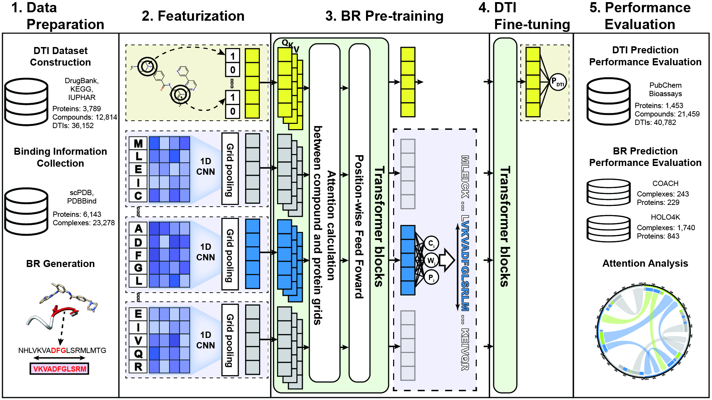

# HoTS: Sequence based prediction of binding regions and drug-target interactions

## Introduction

Recently, many feature based drug-target interaction (DTI) prediction models are developed.
Especially, for protein feature, many models take raw amino acid sequence as the input, building end-to-end model.

This model gives some advantages for prediction, such as

  * Model catches local patterns of feature, whose information is lost in global feature. 
  * Model becomes more informative and interpretable than model using global feature

DeepConv-DTI and DeepAffinity show that deep learning model with protein sequence actually capture local residue pattern participating in interaction with ligands.
Therefore, we can hypothesize that increasing ability to capture important local residue patterns will also increase performance of prediction.
But, how can increase ability to capture important local motifs for drug-target prediction model?

In DeepConv-DTI, variety size of convolutional neural networks (CNN) play role of capturing local residue patterns
Then, we can explicitly train CNN and further layers to concentrate on binding information.

So, we built model on protein sequence to predict ``binding region (BR)``, which is called **Highlights on Protein Sequence (HoTS)**.
We predict BR of protein in the way of object detection in image processing field.

We refers **BR** as consecutive subsequence including ``binding pockets/sites (binding information, BI)`` interacting with ligand in protein-ligand complex.
Procedure of generating BR from BI is summarized in [ipython notbook](SampleData/HoTS/Parsing_scPDB_for_HoTS.ipynb) 

By predicting `BR, performance of DTI prediction increase than previous model [DeepConv-DTI](https://journals.plos.org/ploscompbiol/article?id=10.1371/journal.pcbi.1007129).

Moreover, as pointed in [studies](https://www.researchgate.net/publication/335085389_Improved_fragment_sampling_for_ab_initio_protein_structure_prediction_using_deep_neural_networks), inter-dependency between protein moitifs must be considered for better respresentation

Our model utilized [Transformers](https://arxiv.org/abs/1706.03762) to model interdependency between sequential grids.
Moreover, we added compound token before protein grids as ``<CLS>`` token is added to predict class of sentence. Transformer also will model interaction between protein and compound.

Our model is depicted as [overview figure](Figures/Fig_1.jpg)

## License


HoTS follow [GPL 3.0v license](LICENSE). Therefore, HoTS is open source and free to use for everyone.

However, compounds which are found by using HoTS follows [CC-BY-NC-4.0](CC-BY-NC-SA-4.0). Thus, those compounds are freely available for academic purpose or individual research, but restricted for commecial use.

## Contact

hjnam@gist.ac.kr

dlsrnsladlek@gist.ac.kr


## Overview Figure



## Environment set-up

conda environment file `[environment.yml](environment.yml)` is provided

``` 
conda env create --name envname --file=environments.yml
```

## Usage

```
    This Python script is used to train, validate sequence-based deep learning model for prediction of drug-target interaction (DTI) and binding region (BR)
    Deep learning model will be built by Keras with tensorflow.
    You can set almost hyper-parameters as you want, See below parameter description
    DTI, drug and protein data must be written as csv file format. And feature should be tab-delimited format for script to parse data.
    And for HoTS, Protein Sequence, binding region and SMILES are need in tsv. you can check the format in sample data. 

    Requirement
    ============================ 
    tensorflow == 1.12.0 
    keras == 2.2.4 
    numpy 
    pandas 
    scikit-learn 
    tqdm
    rdkit
    ============================

    contact : dlsrnsladlek@gist.ac.kr
              hjnam@gist.ac.kr
```

# Input config specification

Input config file should be `json` format and each value should be specified as following:

## Input file paramters
```
    "dti_dir"			: Training DTI file path
    "drug_dir"			: Training Compound file path
    "protein_dir"		: Training Protein file path
    "hots_dir"			: Training BR file path
    "validation_dti_dir"	: Validation file path
    "validation_drug_dir"	: Validaton file path
    "validation_protein_dir"	: Validation file path
    "validation_hots_dir"	: Validation BR file path
```
## Compound feature paramters
```    
    "drug_len"		: the number of bits for Morgan fingerprint
    "radius"			" the size of radius for Morgan fingerprint
```
## Model shape parameters
```
    "window_sizes"		: Protein convolution window sizes (should be list of integers)
    "n_filters"			: Convolution filter size
    "drug_layers"		: Dense layers on compound fingerprint (should be list of integers)
    "hots_dimension"		: Size of dimension for Transformer
    "n_heads"			: the number of heads in Transformer
    "n_transformers_hots"	: the number of Transformer blocks for BR prediction
    "n_transformers_dti"	: the number of Transformer blocks for DTI prediction
    "hots_fc_layers"		: Dense layers for BR prediction (should be list of integers)
    "dti_fc_layers"		: Dense layers for DTI prediction (should be list of integers)
    "anchors"			: Predifined widths (anchor without coord offset, should be list of integers)
    "grid_size"			: Protein grid size
```
## Training parameters
```
    "learning_rate"		: Learning rate
    "n_pretrain"		: the number of BR pre-training epochs
    "n_epochs"		: the number of DTI training epochs
    "hots_ratio"		: the number of BR training epochs per one DTI training
    "activation"		: activation function of model
    "dropout"			: Dropout rate
    "batch_size"		: Training mini-batch size
    "decay"			: Learning rate decay
```
## Loss parameters
```
    "retina_loss"		: Retina loss weight
    "confidence_loss"		: Confidence loss weight for BR prediction
    "regression_loss"		: Regression loss weight for BR prediction
    "negative_loss"		: Negative loss eight for BR prediction
``` 
## Output paramters
```
    "output"			: Output file path, this script will result in 
					{output}.config.json	: Model hyperparameter file
					{output}.HoTS.h5	: BR prediction model weight file
					{output}.DTI.h5	: DTI prediction model weight file
```

### Example command

defaults values are set as optimized parameter so you can train HoTS model with following command
 
```
python train_HoTS.py input_config.json
```

with trained model, you can predict BRs and DTIs.

Please read, this notebook

[Prediction with trained model](Prediction_with_trained_model.ipynb)
